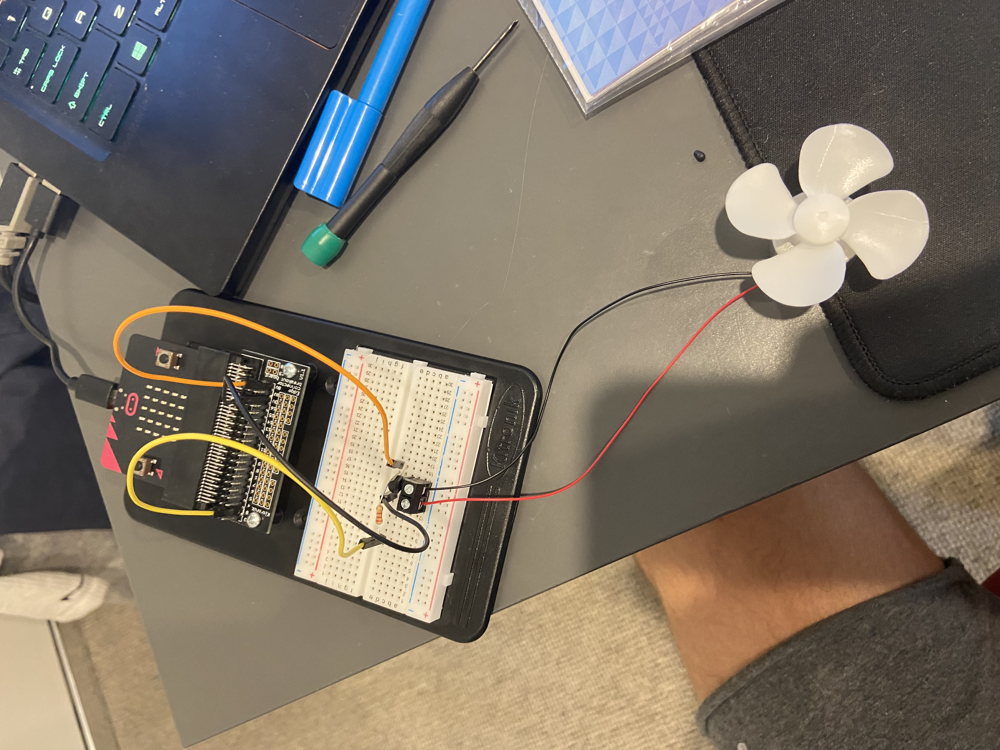

# Inventor Kit Experiments

*Markdown reference: https://guides.github.com/features/mastering-markdown/*

## Instructions ##

*For a selection of 5 inventor kit experiments that you choose, fill out the following sections.

### Experiment name ###

Say "HELLO" to the BBC micro:bit!
#### Photo of completed project ####

photo of the face that first apears when a button is pressed.

#### Reflection ####

In this experiment, something new to me was or something I learned was how to code the micro:bit in order to get it to show text on its little led screen.

This experiment could be the basis of a real world application such as a very basic version of a kids toy with buttons that activate diffrent options.

### Experiment name ###

Using A Light sensor & Analog Inputs

#### Photo of completed project ####

photo of the night setting

#### Reflection ####

In this experiment, something new to me was or something I learned was how to use a light sensor when its connected to a breadboard.

This experiment could be the basis of a real world application such as a device that turns lights of out side when it gets below a certain light level.

### Experiment name ###

Using a transistor to drive a motor

#### Photo of completed project ####

photo of fan setup

#### Reflection ####

In this experiment, something new to me was or something I learned was how to use a transistor to controll the current.

This experiment could be the basis of a real world application such as a car. A power grid. a transistor can controll the amount of power reachign each house so that it does not cause a electrical fire or a shortage. 

### Experiment name ###

Dimming an LED using a potentiometer

#### Photo of completed project ####

photo of bright setting

#### Reflection ####

In this experiment, something new to me was or something I learned was how to set up all the wires and positioning of transistors aswell as a button.

This experiment could be the basis of a real world application such as a light switch in the house that has the option of changing brightness.

### Experiment name ###

Using the accelerometer to control motor speed.

#### Photo of completed project ####

photo of setup

#### Reflection ####

In this experiment, something new to me was or something I learned was i learnt how to controll the speed of the fan using the accelerometer. I also learnt that a G is an acceleration of 9.81 meters per second per second.

This experiment could be the basis of a real world application such as a deep sea compas as it shows the gravity which would alow you to determin up. 

