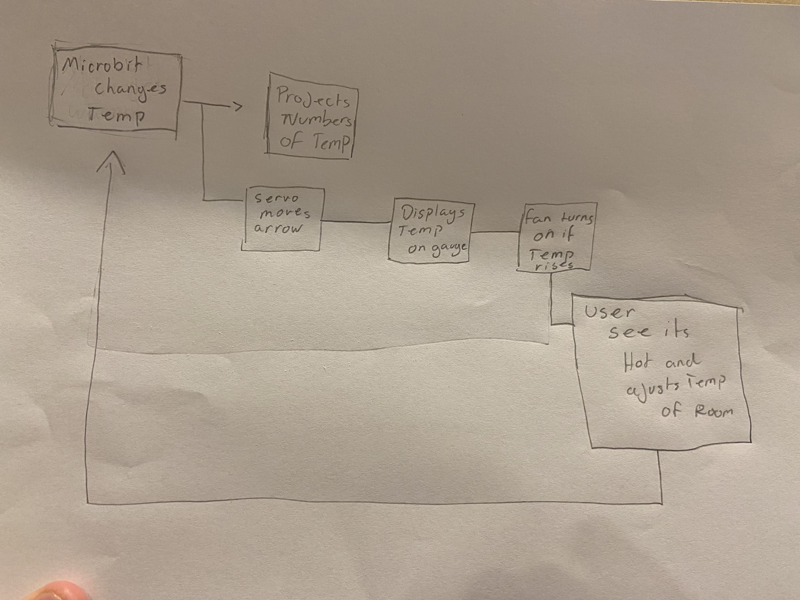
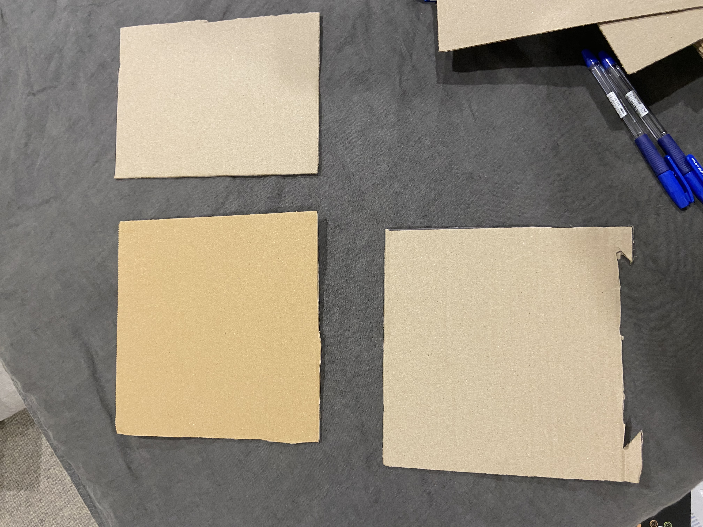
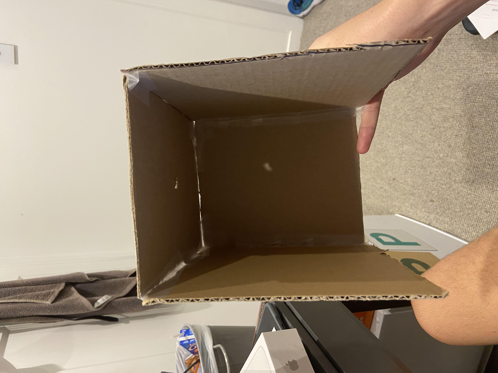
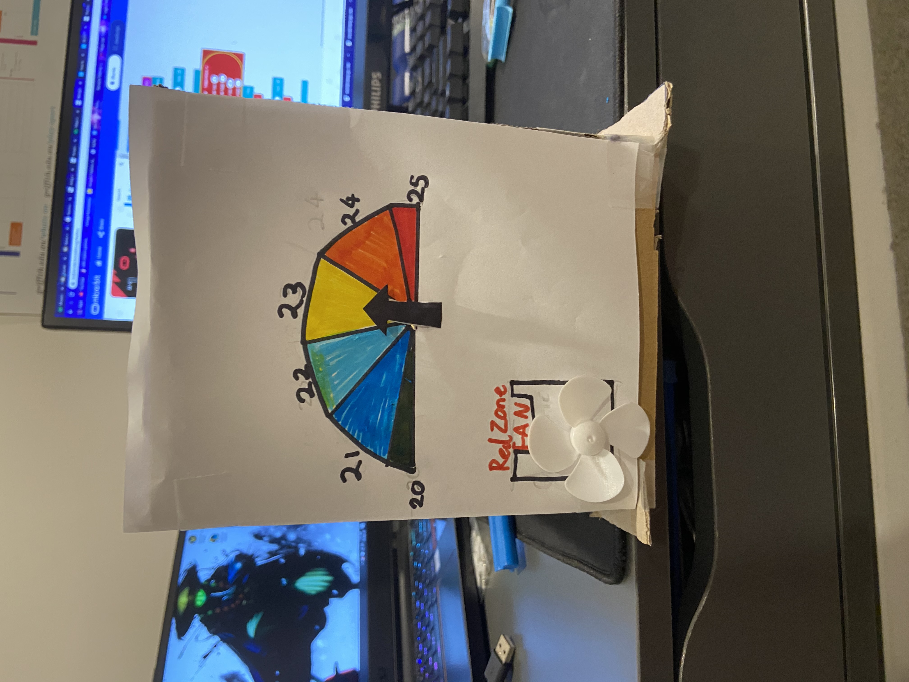
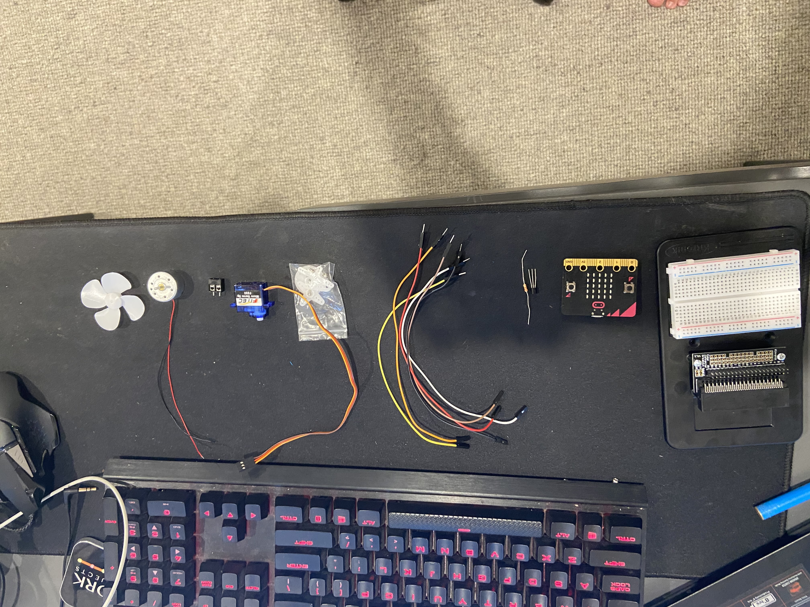
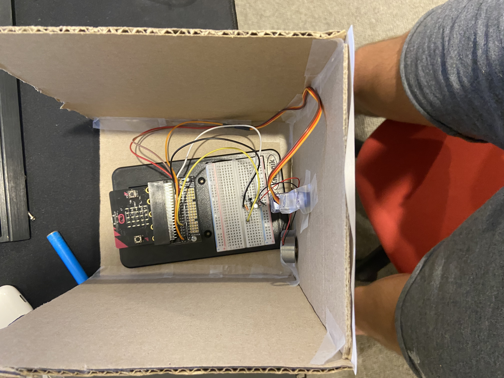
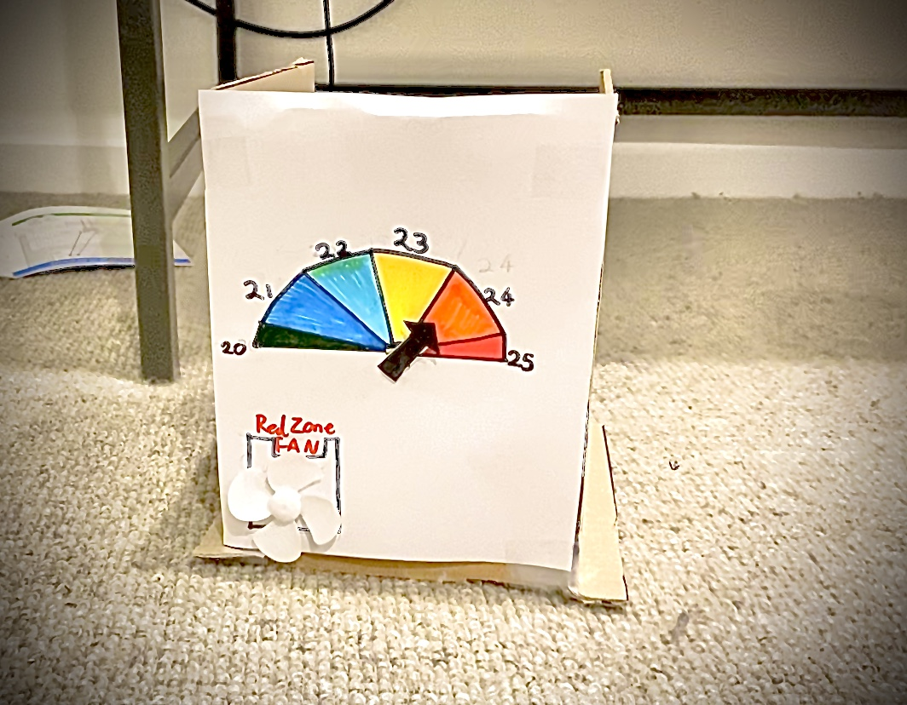

# Assessment 1: Replication project

*Markdown reference:* [https://guides.github.com/features/mastering-markdown/](http://guides.github.com/features/mastering-markdown/)

## Replication project choice ##
Temperature gauge

## Related projects ##

### Related project 1 ###
How to Read Temperature Using BBC Micro:bit

https://www.hackster.io/anish78/how-to-read-temperature-using-bbc-micro-bit-34bf58

This project is related to mine because it uses the microbits inbuilt temperature sensor which is also used in my project for showing the temperature.
  
### Related project 2 ###
Indoor-outdoor thermometer

https://microbit.org/projects/make-it-code-it/indoor-outdoor-thermometer/

This project is related to mine because it is a thermometer that can pickup the temperature around it and display it on a screen that is used in project to configure the gauge. 

  ### Related project 3 ###  
    case 02 Smart Fan
    
    https://www.elecfreaks.com/learn-en/microbitKit/smart_home_kit/smart_home_case_02.html
    
   
    
   This project is related to mine because it uses a temperature sensor to turn the fan on until the room cools which is what my project is also trying to attain usuing a mini fan when the temperature reaches a certin degree.   
    
   ### Related project 4 ###
   How to Create Temperature Gauge Using Micro:bit
   
   https://www.hackster.io/anish78/how-to-create-temperature-gauge-using-micro-bit-a601cc
   
   
   
   This project is related to mine because it is also a temperature gauge that adjust it arrow to the position that the room is sitting at just like my project except this project lacks the fan. The code in this project is very similar. 
   
   ### Related project 5 ###
   Micro:bit Experiment 07:Temperature Sensor
   
   https://www.elecfreaks.com/store/blog/post/microbit-experiment-07temperature-sensor-elecfreaks-mirco-bit-starter-kit-course.html
   
   
   
   This project is related to mine because it uses a bread bored to assist in its role of measuring temperature. 
  
  ### Related project 6 ###
  Make A Micro:Bit Controlled Fan!
  
  https://www.vellemanformakers.com/make-a-microbit-controlled-fan/
  
  
  
  This project is related to mine because it uses the micro bit to turn the fan off and on using a button. Although my project does not use a button to controll fan it is still coded to turn off and on under special circumstances. 
  
## Reading reflections ##
*Reflective reading is an important part of actually making your reading worthwhile. Don't just read the words to understand what they say: read to see how the ideas in the text fit with and potentially change your existing knowledge and maybe even conceptual frameworks. We assume you can basically figure out what the readings mean, but the more important process is to understand how that changes what you think, particularly in the context of your project.*

*For each of the assigned readings, answer the questions below.*

### Reading: Don Norman, The Design of Everyday Things, Chapter 1 (The Psychopathology of Everyday Things) ###

*What I thought before: Describe something that you thought or believed before you read the source that was challenged by the reading.*

I though before the reading that the reason people press buttons on crosswalks and elivators was to make the system thing that there is a larger demand for it there for tricking the machiene into going faster. The source challenged my view on this by arguing that the reason it is done is because there is a lack of feedback. The feedback missing is the ability to let you know its working on you request. 
*What I learned: Describe what you now know or believe as a result of the reading. Don't just describe the reading: write about what changed in YOUR knowledge.*

I learned that the feedback we recieve from things is very important and tricky to get right. I had the view that a simple form of feedback could do the jb like a buzz for example. What changed my view was when Norman explained how a ill equipped feedback system can be annoying more than it is helpful and can often turn people away from the device. Gettign the timing and tone of the feedback right is crutial and should be a main focus when designing an project. 

*What I would like to know more about: Describe or write a question about something that you would be interested in knowing more about.*
I would like to know how me or a company can go about finding the right feedback for diffrent situations,people and cultures. How could this be tested and achieved. 

*How this relates to the project I am working on: Describe the connection between the ideas in the reading and one of your current projects or how ideas in the reading could be used to improve your project.*

This reading relates to my project because it touches on the way users look at something and the best way is to keep them involved in what they are lookig at. For example I can use the infomation i have recieved from this reading to make myproject more user friendly. I can attempt ways of signaling that though making a hand move towards a colour to signify hot or cold, or a fan copuld spin if it became to hot to let the user know to cool down. 

### Reading: Chapter 1 of Dan Saffer, Microinteractions: Designing with Details, Chapter 1 ###

*What I thought before: Describe something that you thought or believed before you read the source that was challenged by the reading.*

Before this reading i had no prior knowlege to the premise of micro interactions. I found that they are extremly common especially in todyas society and that a failure or lack of a microinteraction can lead to disaster

*What I learned: Describe what you now know or believe as a result of the reading. Don't just describe the reading: write about what changed in YOUR knowledge.*
I learned that microinteractions have a huge roll in making a design more functional and easier to use for a user. They often give the product a reason to be bought due to one of its features. 

*What I would like to know more about: Describe or write a question about something that you would be interested in knowing more about.*

I would like to know how the micro interactions cause users to favor the device more that other devices with either less or worse microinteractions. Why does it have such an effect on the way people views these things. 

*How this relates to the project I am working on: Describe the connection between the ideas in the reading and one of your current projects or how ideas in the reading could be used to improve your project.*

This will help my project as i can use what i have learnt about micro interactions to make my design more favourable towards people. I can do this by making a button or a heat sencor available to use.  

### Reading: Scott Sullivan, Prototyping Interactive Objects ###

*What I thought before: Describe something that you thought or believed before you read the source that was challenged by the reading.*

My thoughts before this reading was there is  apoint where you are no longer learning from your failures and there is no point contiuing. This reading challenged this by proving that no matter how many mistakes they could make there is always a learing experience that can be drawed apon for future attempts.

*What I learned: Describe what you now know or believe as a result of the reading. Don't just describe the reading: write about what changed in YOUR knowledge.*

I learnt that there is always a soulution to the project if you test and fail enough untill you have the right infomation to complete the project. It is very hard to complete something first try so the Beta testing period along with others in essiental to success. 

*What I would like to know more about: Describe or write a question about something that you would be interested in knowing more about.*

I would like to know more about the processes they went through for other projects and the results they recieved from them. 

*How this relates to the project I am working on: Describe the connection between the ideas in the reading and one of your current projects or how ideas in the reading could be used to improve your project.*

This is a great reading for my project. When i run into barriers i can test and teast untill i find the issue then move on. By doing this i will eventually succseed in my project. I also learnt that i can use various way to reach the goal not just one. 

## Interaction flowchart ##

## Process documentation

*In this section, include text and images that represent the development of your project including sources you've found (URLs and written references), choices you've made, sketches you've done, iterations completed, materials you've investigated, and code samples. Use the markdown reference for help in formatting the material.*

*This should have quite a lot of information!*

*There will likely by a dozen or so images of the project under construction. The images should help explain why you've made the choices you've made as well as what you have done. Use the code below to include images, and copy it for each image, updating the information for each.*

My project was built out or card boared and paper. The cardboared used was to creat the box for the electronics to sit in. I cut the card boared (that i sourced from the university) into squared and cut slits into the face so that it could fit into the other pieces this way all i needed to youse was stick tape to hold it up. I also used the paper for creating the face and arrow of the gauge. i drew with sharpie and texter to get the colours that i desired.I chose to yourse card board because it is easy to source, light and also strong. I chose to use a bread board to complete my project as it has the ability to connect muliple devides at once for example my fan and servo.I was also having trouble when trying to make it without the bread board as the wires were falling out and not making great connections with the equipment I had on hand.  I poked holes in the front yousing a small screw driver and scissors. When constructing the basic servo connected with the temperature, I watched a youtube tutorial to help me build and code the piece.(https://www.youtube.com/watch?v=Hi3Km1PV45M) 

## Project outcome ##

*Complete the following information.*

### Project title ###
Temperature gauge
### Project description ###
The temperature gauge measures the temperature in the room and spins a fan once it reaches a cirtin temperature threshold alerting the user to cool the room down untill the fan turns off. A typical use case for the gauge would be if the user was trying to keep the room at a temperature while conserving air conditioning. This could be a method of keeping ontop of the room temp. 
### Showcase image ###

### Additional view ###

### Reflection ###

I found that the gauge on my project was quite acurate and fast when responding to a sudden change in temperature. The fan also functioned well although there was a small delay between turning off and on. I would change the design of my box and next time i had accessto a laster cutter and some exact measurments to creat the box out of wood. i would also prefer to use hot glue instead of sticky tape. The fan I found to be quite good at alerting the user when the gauge was getting hot although the positioning of it could of been on the other side of the face under the red quadrint of the gauge.Aside from the fan i could of also used a speaker.

*What techniques, approaches, skills, or information did you find useful from other sources (such as the related projects you identified earlier)?*
I found that having already done the fan experiment the coding and the building to be quite easy. A youtube tutorial also assisted me when making and coding my servo to act the way i had intendid it to after struggling with it earlier. I found that reading about how the code works in the inventors kit book helped me to understand the code and get the project dont and trial and error. A lot of testing had to be done before the final project cam together. I tested every part individualy before completing the project. 

*What ideas have you read, heard, or seen that informed your thinking on this project? (Provide references.)*
I used the main idea from the assesment brief that i recieved. I had also heared people talk about how using aircon is so xpensive and that they wanted a way to monitor the temp in the room at all times so they didnt have to keep it on when unnecessary. This inspired my idea of alerting the user of the temperature in the room.

*What might be an interesting extension of this project? In what other contexts might this project be used?*
